MyExam — Plateforme de gestion d’examens en ligne

MyExam est une application web développée avec Laravel, MySQL et TailwindCSS permettant aux enseignants de créer, gérer et corriger des examens en ligne.

Le projet propose deux espaces distincts :

👨‍🏫 Espace Enseignant
👨‍🎓 Espace Étudiant

L’application permet la création d’examens interactifs avec différents types de questions et un système de correction automatique.

🚀 Technologies utilisées
Laravel
PHP
MySQL
TailwindCSS
Vite
Blade
JavaScript
✨ Fonctionnalités principales
👨‍🏫 Enseignant
Authentification sécurisée
Création d’examens
Gestion des étudiants
Ajout de questions :
QCM
Vrai / Faux
Réponse texte
Correction automatique
Attribution d’une note finale
Consultation des copies
Export PDF
Export CSV
Organisation des étudiants par formation
👨‍🎓 Étudiant
Connexion sécurisée
Consultation des examens
Passage des examens en ligne
Affichage du score automatique
Consultation des résultats
Visualisation des corrections

# 📸 Captures d’écran

## 🏠 Page d’accueil

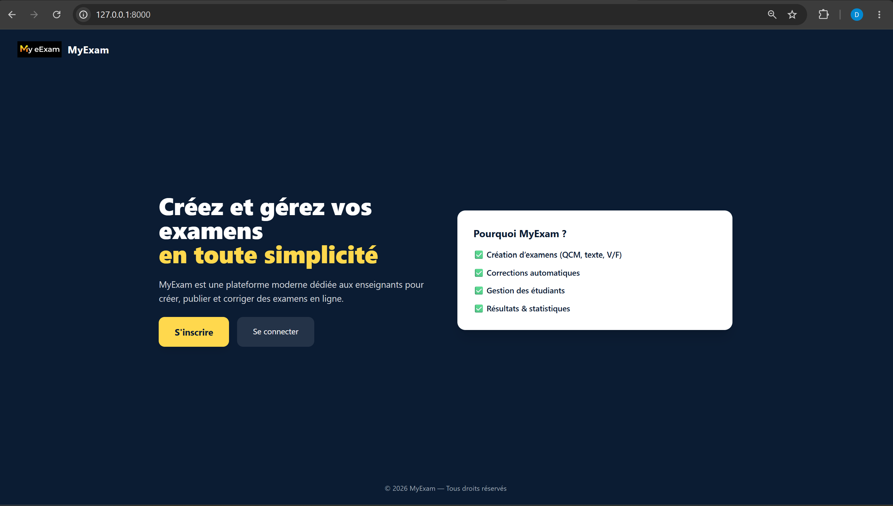

---

## 🔐 Connexion

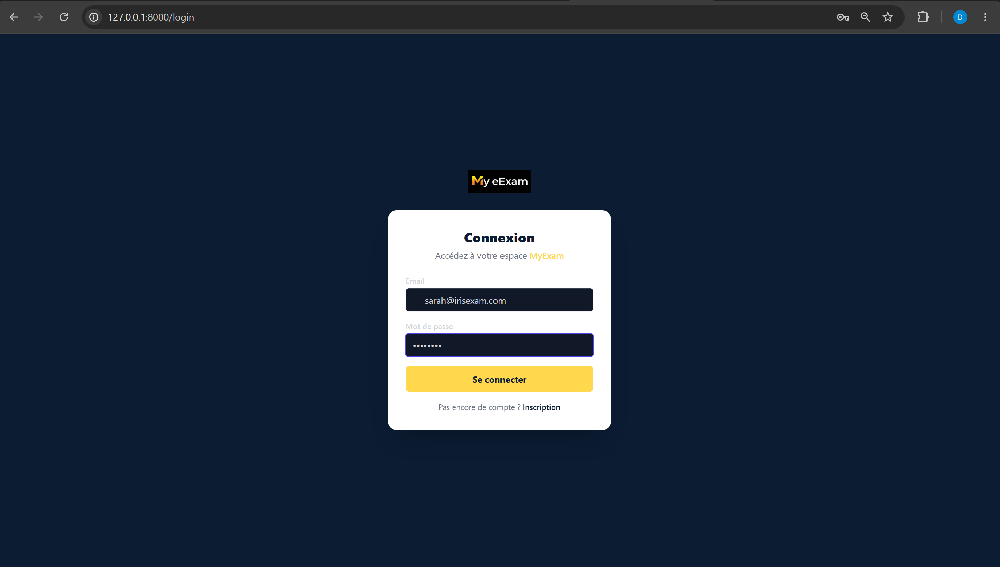

---

## 📊 Dashboard administrateur

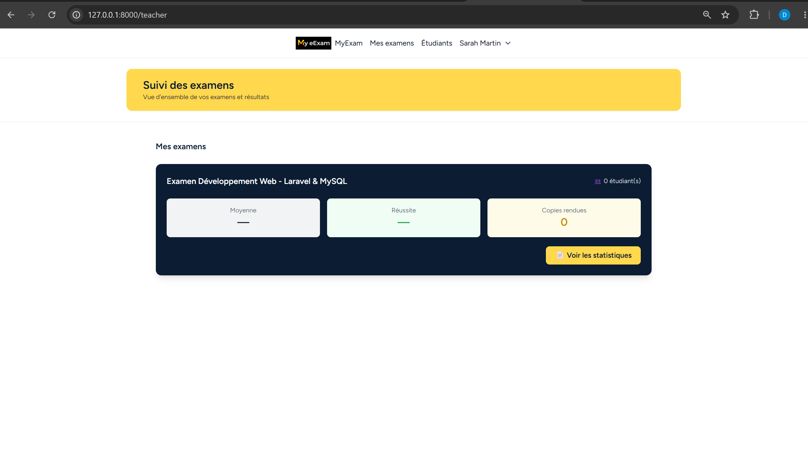

---

## 📝 Création d’examen

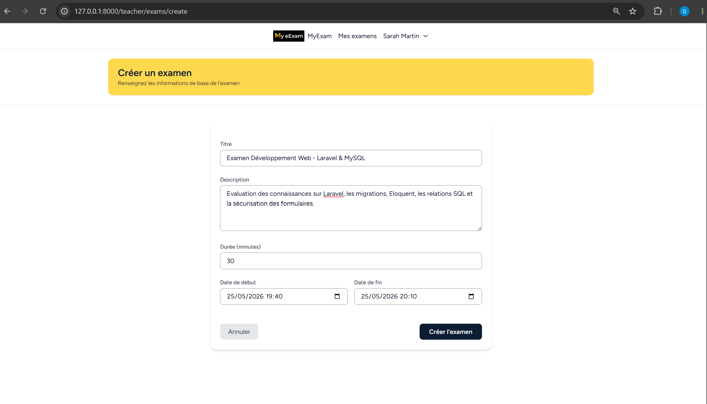

---

## ❓ Gestion des questions

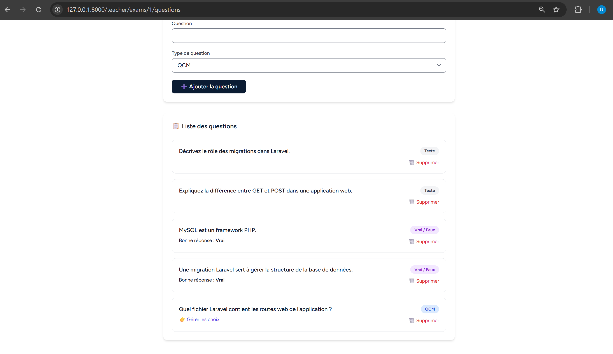

---

## ☑️ Question QCM

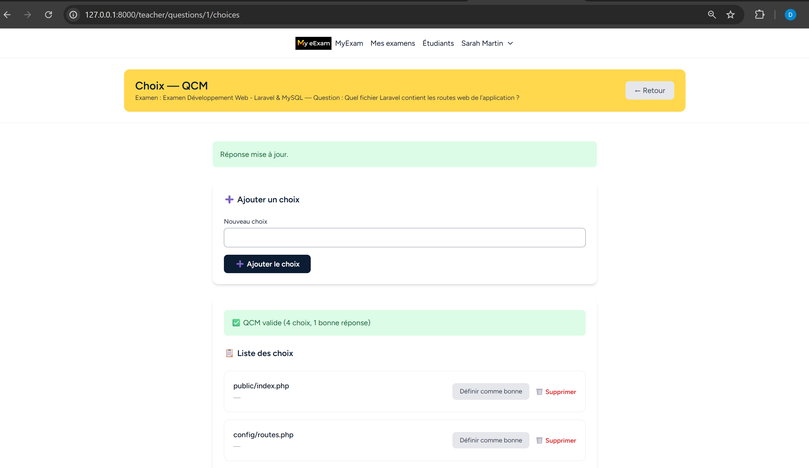

---

## 👨‍🎓 Dashboard étudiant

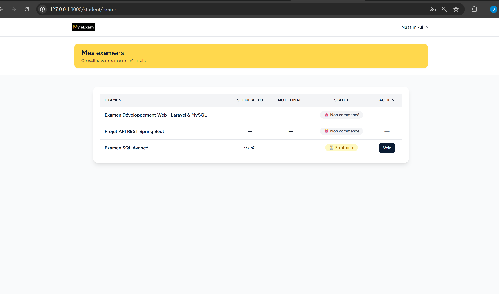

---

## 📚 Interface examen étudiant

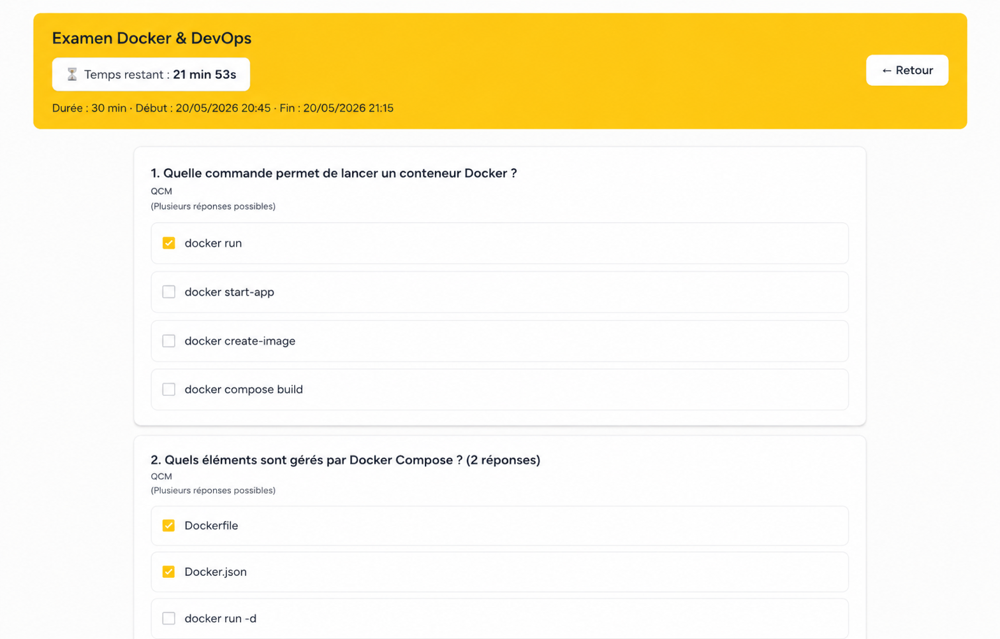

---

## ✍️ Réponses étudiant

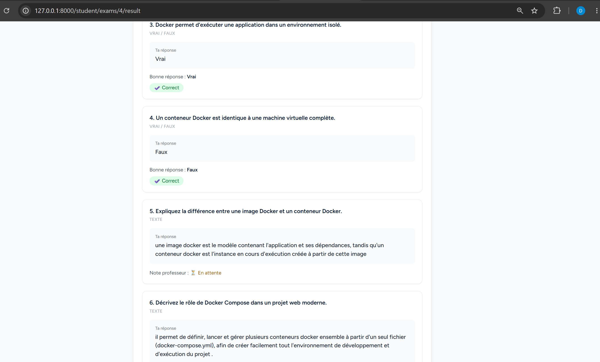

---

## 📈 Statistiques

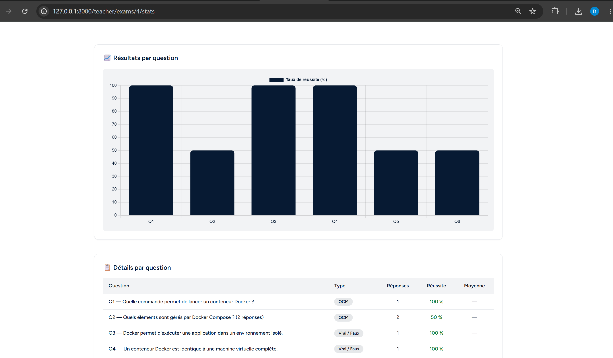

---

## 📄 Export PDF des copies

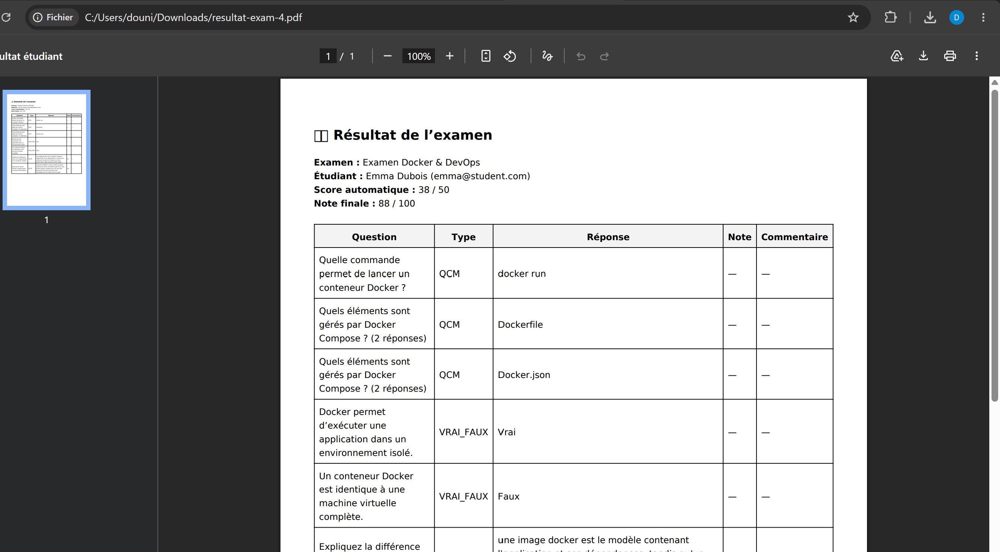

---

## 🛡️ Système anti-cheating

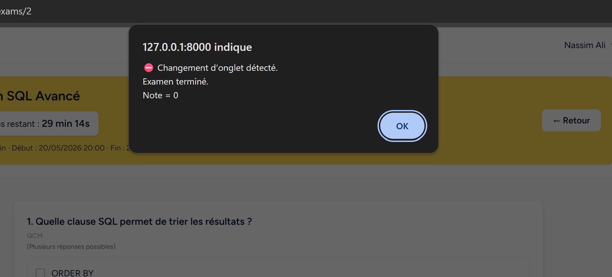

---

## ⏳ Résultat en attente

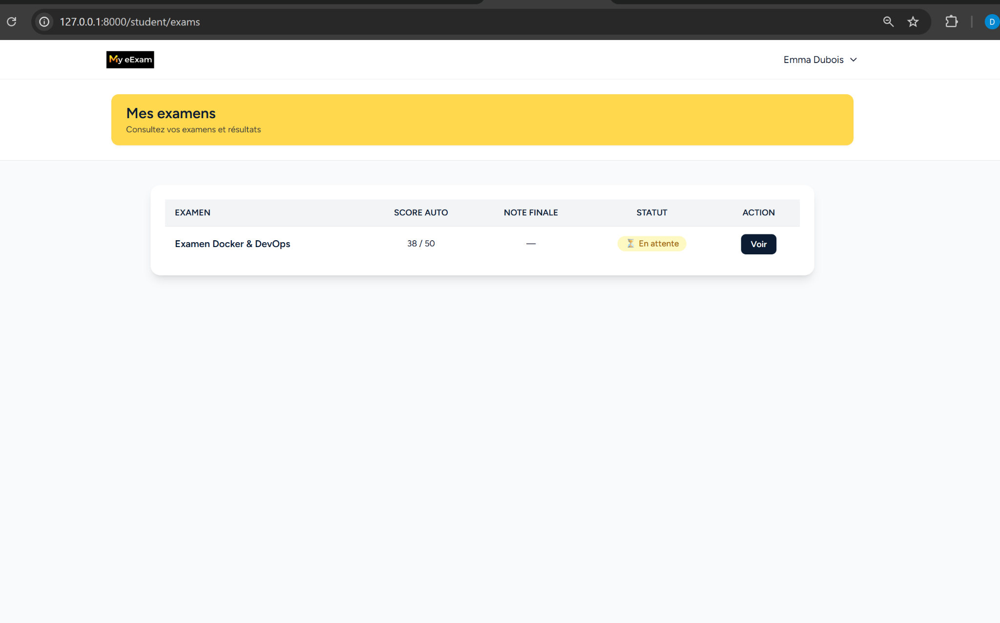

---

## 📄 Copies corrigées par le professeur

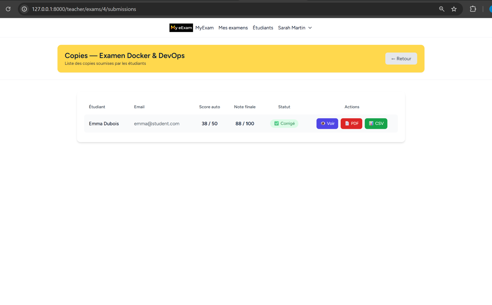

---

## 👨‍🎓 Liste des étudiants

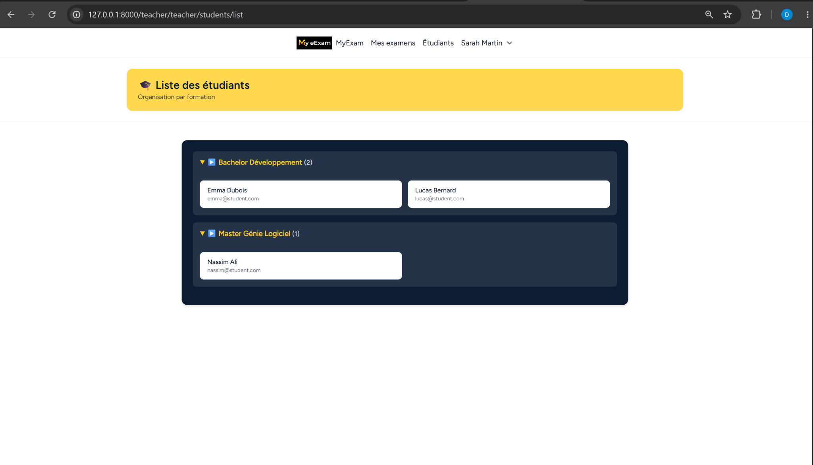

---

## ✅ Résultat final étudiant

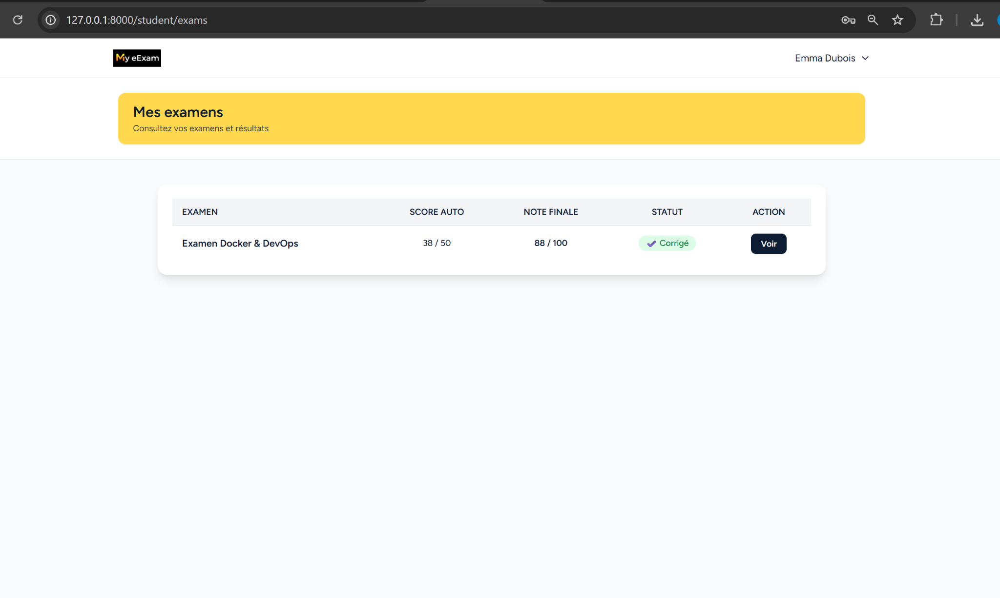

---

## 📋 Détail des réponses et correction

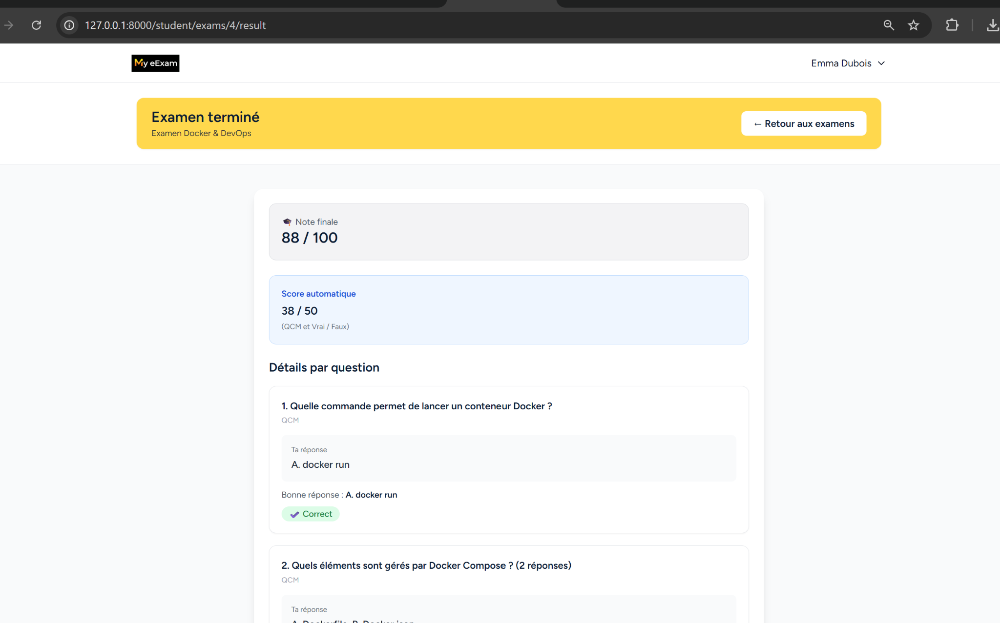
⚙️ Installation
1. Cloner le projet
git clone https://github.com/votre-compte/IrisExams.git
2. Accéder au dossier
cd IrisExams
3. Installer les dépendances PHP
composer install
4. Installer les dépendances frontend
npm install
5. Configurer l’environnement

Créer le fichier .env :

cp .env.example .env

Configurer la base de données dans .env.

6. Générer la clé Laravel
php artisan key:generate
7. Lancer les migrations
php artisan migrate
8. Lancer le serveur
php artisan serve
9. Compiler les assets
npm run dev

📁 Structure du projet
app/
bootstrap/
config/
database/
public/
resources/
routes/
screenshots/
storage/
tests/
🎯 Objectif du projet

Ce projet a été réalisé dans le cadre d’un portfolio de développement web afin de mettre en pratique :

Laravel
Gestion des rôles utilisateurs
CRUD avancé
Relations entre tables
Authentification
Gestion d’examens en ligne
Export de données
Interface moderne responsive
👩‍💻 Auteur

Dounia Lallouche
Master Développement & Base de Données